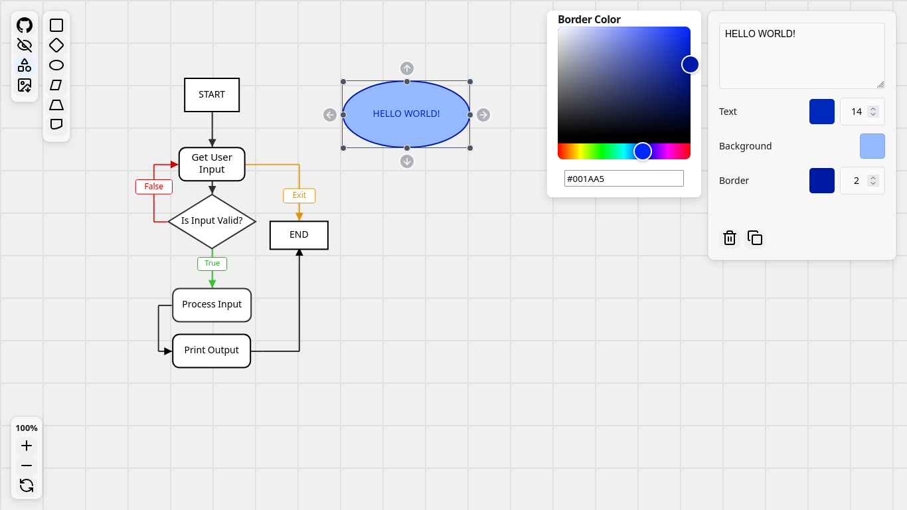
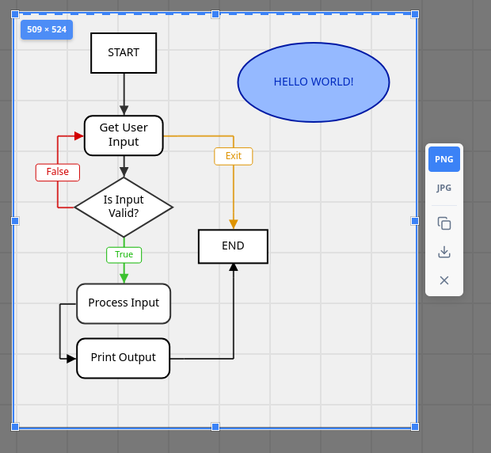

# Flow Diagram Editor

[](https://skillicons.dev)

A web-based flow diagram application built with **React**, **TypeScript**, and **Vite**.

Designed as a **Diagram Editor User Interface** powered by a custom **Diagramming Engine**, this project focuses on the interactive rendering and editing of flow diagrams. It provides an open canvas for managing diagram elements and it's styling, It features a stepped polyline routing system that maintains orthogonal connections between elements.

[**View Live Application**](https://flow-diagram-editor.vercel.app)

## Preview




---
## Features

### Core Functionality

#### Canvas

* Pan by dragging the background
* Zoom via scroll wheel or on-screen controls
* All interactions respect canvas transforms

#### Nodes (Shapes)

* Create nodes with different shapes
* Drag and resize nodes freely
* Select nodes to edit content and apply styles

#### Edges (Lines)

* Connect nodes using directed edges
* Choose between straight or stepped (elbow) connectors
* Stepped lines automatically maintain 90-degree angles
* Create edges via arrow handles on selected nodes
* Edges automatically update when connected nodes move
* Edge endpoints snap to the nearest anchor point

#### Export

* Use a Flameshot-inspired interface for exporting your diagrams
* Export diagrams as **PNG** or **JPEG**
* Export is viewport-based by design (only what is visible is rendered)
* Export via file download or clipboard (copy + paste)

---
### Styling Options

* Background color
* Border color, width, and radius
* Line width
* Text color and font size

## Built With

This project stands on the shoulders of these awesome open-source libraries:

* **[Zustand](https://github.com/pmndrs/zustand)** - For managing the complex diagram state without the boilerplate.
* **[Lucide React](https://lucide.dev/)** - For the clean, consistent UI icons.
* **[html-to-image](https://github.com/bubkoo/html-to-image)** - Powering the "Export to PNG/JPEG" functionality.
* **[react-colorful](https://github.com/omgovich/react-colorful)** - For the lightweight color picker component.
* **[downloadjs](https://github.com/rndme/download)** - Handling the browser file downloads.
* **[uuid](https://github.com/uuidjs/uuid)** - Generating unique IDs.
 
---
## Installation

### Requirements

* Node.js 18 or newer
* Modern browser

### Setup

```bash
git clone < repo-url + ".git" >
cd < repo-name >
npm install
npm run dev
```

---

## License

**MIT License**
