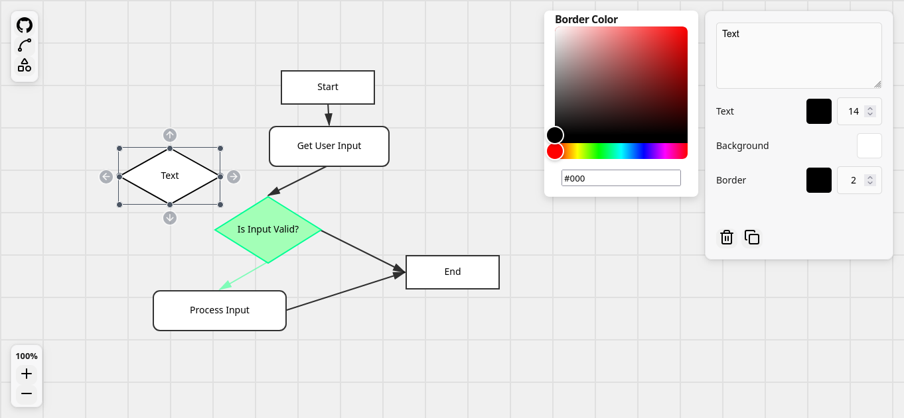

# Flowchart Maker
[](https://skillicons.dev)

A web-based flowchart editor built with Vite, React, and TypeScript. Users can create, manipulate, style, and connect nodes on a canvas.

## Snapshot


## Features

### Core Functionality

* **Node Creation and Manipulation**
  * Drag and resize nodes
  * Select nodes to apply styling and edit content
  * Create nodes with shape options
* **Canvas Interaction**
  * Pan by dragging the background
  * Zoom using the scroll wheel or on-screen controls 
* **Edges**
  * Connect nodes with directed edges
  * Create new edges using the arrow handles when a node is selected
  * Connected edges automatically update when nodes move
  * Edges snap to the nearest anchor point

### Styling

* Background color
* Border color and width
* Rounded or square border
* Text color, font size, and font weight

## Install

```bash
# using npm
git clone <repo-url>
cd <repo-name>
npm install
npm run dev
```
